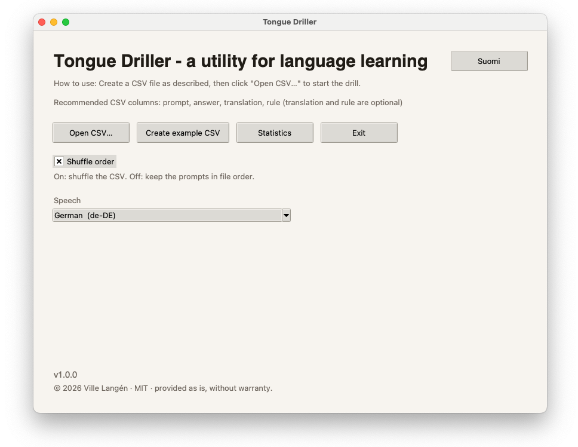
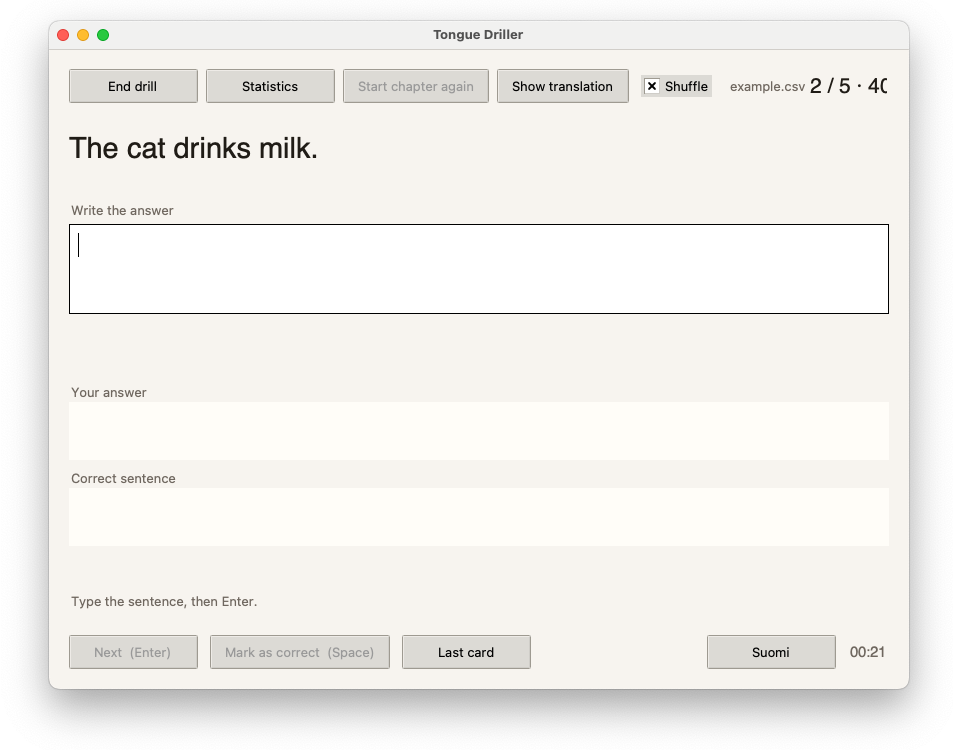
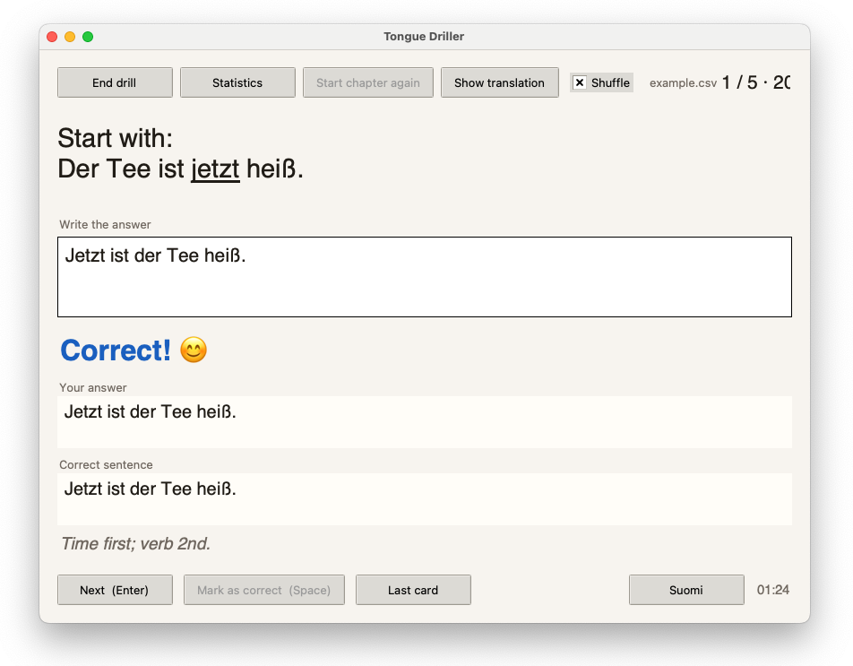
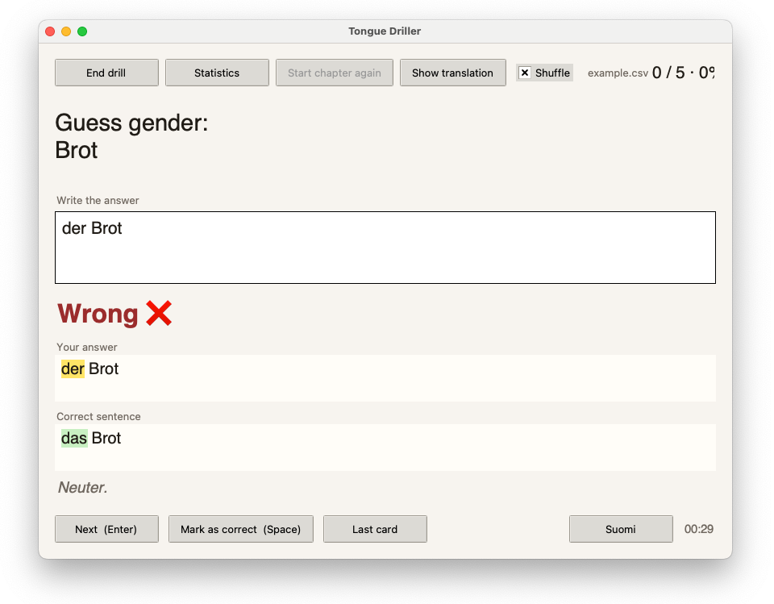
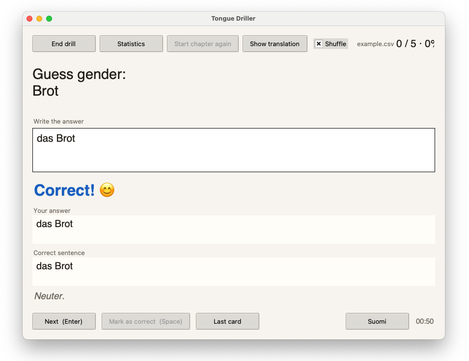
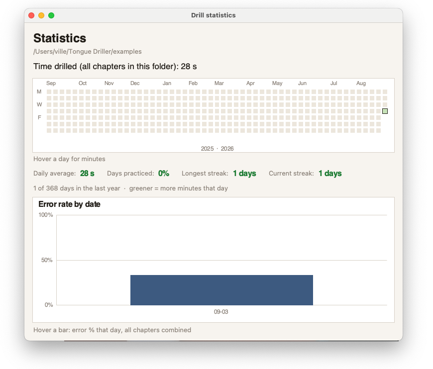

**Tongue Driller** is a small **desktop** app by Ville Langén for language drills. Prompt on top, type the answer, Enter to check. Optional translation, grammar note, and spoken answer (TTS). UI in Finnish or English.

**You can use it** (download first):

- **macOS Apple Silicon:** [TongueDriller-arm64.dmg](https://github.com/vljlangen/tongue-driller/releases/download/v1.0.0/TongueDriller-arm64.dmg)
- **macOS Intel:** [TongueDriller-intel.dmg](https://github.com/vljlangen/tongue-driller/releases/download/v1.0.0/TongueDriller-intel.dmg)
- **Windows:** [TongueDriller.exe](https://github.com/vljlangen/tongue-driller/releases/download/v1.0.0/TongueDriller.exe)

All builds and notes: [GitHub Releases (v1.0.0)](https://github.com/vljlangen/tongue-driller/releases/tag/v1.0.0).

### Opening screen

Open a CSV chapter, create the built-in English–German example, toggle shuffle, and pick a speech voice. Switch the UI with **Suomi** / English.



### How it works

1. Open a CSV chapter (or create the example).
2. Read the prompt, type the answer, press Enter.
3. See correct / incorrect; optionally show translation, rule, and hear TTS.

**Examples of how to use the app**

A simple translation: English prompt on top, type the German (or other) sentence below, then Enter.



A word-order drill: prompt on top, your answer below, then instant feedback plus a short grammar tip.



Gender drills work the same way—wrong answers highlight the mismatch; correct ones confirm the article.





### Statistics

Per-folder totals: a year heatmap of minutes drilled, streaks, and an error-rate chart by day.



### CSV format

Recommended columns: **prompt**, **answer**, **translation**, **rule** (last two optional). Headers optional—column 1 is the prompt, column 2 the answer.

- Underscores around a word underline it in the prompt.
- In the file, `\n` starts a new line in the prompt.

Keep personal chapter files private; `chapters/` is gitignored in the public repo.

### Run from source

Needs **Python 3 with Tkinter**:

```bash
python3 drill.py
```

On Mac, Homebrew Python 3.14 often lacks Tkinter—use 3.13 if needed.

### Development & Support

Open source (MIT) on **[GitHub](https://github.com/vljlangen/tongue-driller)**. Issues and ideas welcome there.
