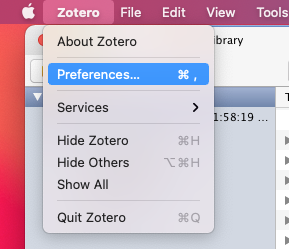
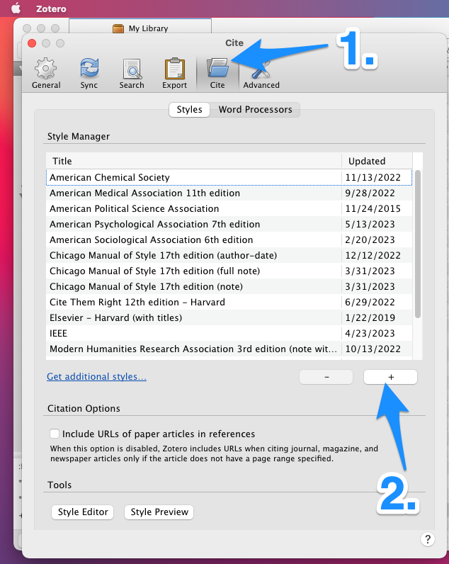
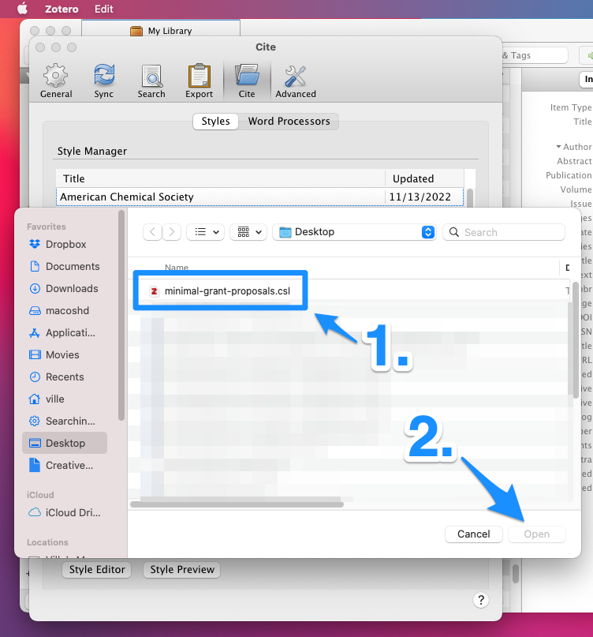

### How to add a (downloaded) citation style to Zotero

1. Click Zotero —> Preferences

2. Select the Cite tab and click on the + sign

3. Navigate to the csl file, select it and click Open

4. If you succeeded to add the new style, it is displayed in the list of the styles in the Style Manager in Zotero

Many thanks to [Anton C. for sharing the style](https://anton.cromba.ch/2016/02/07/a-minimal-citation-stylefor-grant-proposals/) that is showcased in the above image.

