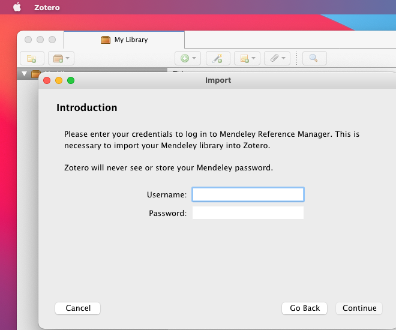

### Introduction

Given the ongoing developments with the newer 'Mendeley Reference Manager', some authors might feel the need to migrate from Mendeley to Zotero. The future will tell, whether “Mendeley Reference Manager” becomes as handy as the former version “Mendeley Desktop”, but for now, you may want to consider the migration to Zotero. 

### Installation of Zotero (unless you already have it)

Before continuing with tutorial, you’ll have to download and install Zotero on your computer from:

https://www.zotero.org/

There are many installation tutorials on the internet, for instance the following by Georgia State University Library:

https://www.youtube.com/watch?v=pueO_XYiS1w

### Signing up in Zotero (unless you already have done it)

The following tutorial video by mr. Haq also explains how to sign up for Zotero, which you will need to do before continuing to the migration tutorial I showcase below.

https://www.youtube.com/watch?v=ERU2-unnCOQ

### Adding the Zotero plug-in for Word (unless you already have the plug-in installed, which you may verify as follows)

1. Click Zotero → Preferences 

2. Click Cite → Word Processors → and if needed, click to the icon that installs the MS Word Add-in (in my case depicted in the image below, it has already been installed and there is no need to do it again)

### Migration from Mendeley to Zotero

After having installed Zotero and signed up in Zotero, you can migrate your references from Mendeley to Zotero. This can be very easily done by following these steps:

1. Sync your Mendeley references to Mendeley servers

Be sure to sync your Mendeley library first. If you are on the older software “Mendeley Desktop”, click the “Sync” button in it. If you are using the newer “Mendeley Reference Manager”, your references have already been synced and you don’t have to care about this step.

2. Back to Zotero, click File → Import

3. Select “Mendeley…” and click “Continue"

4. Type in your Mendeley credentials and click “Continue”.

5. The tick on “Place imported…” may be left on. Click “Continue”.

6. Ready. I’ve been using Mendeley for years, and the importation of my 1119 items took around 20 minutes.

### Usage of Zotero as compared with Mendeley

The usage of Zotero is very intuitive and resembles Mendeley so much that I won’t cover the usage nor the minor differences between these softwares here. You may find excellent and fast tutorials online on sites like YouTube. 

I’ll conclude by reminding that if you have an old Word document that has citations made with the old “Mendeley Desktop” software, the citations can readily be read by the Zotero plug-in in Word, which is a wonderful feature. There is no need to specifically “import” those old MS Word files for use with Zotero.
