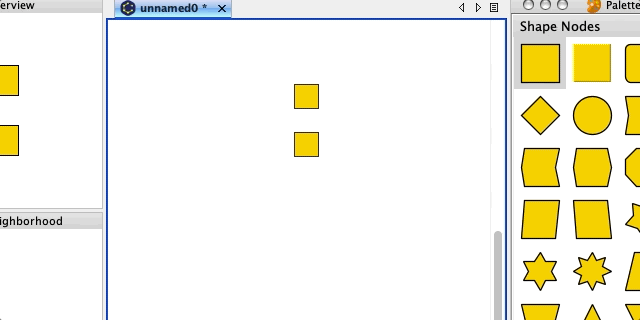
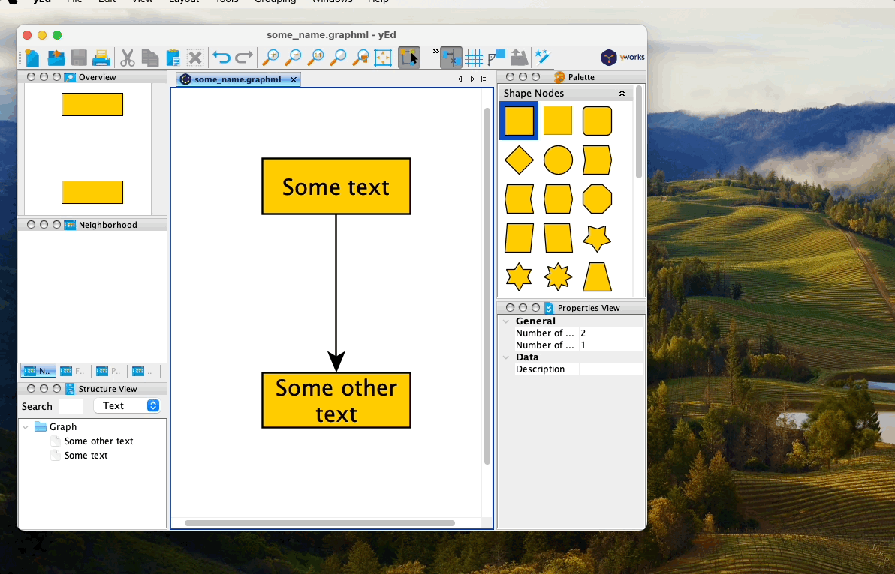
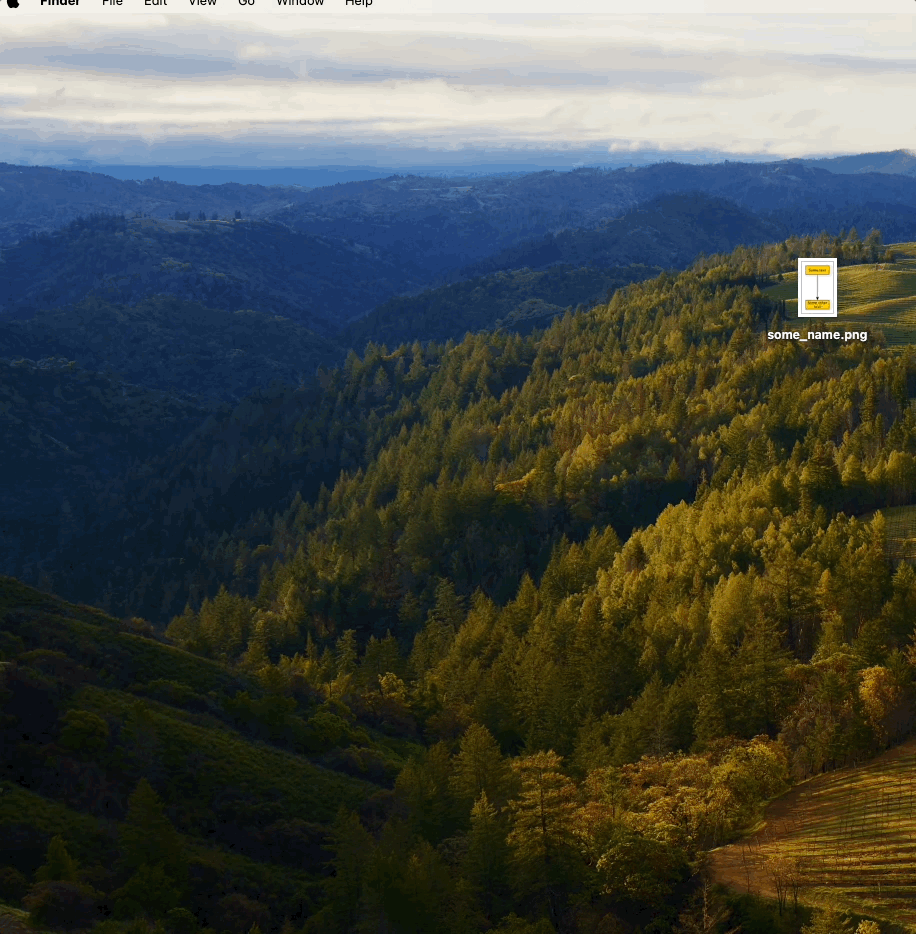

 
 

The free software yEd allows for the creation of flowcharts very quickly. There is no need to manually stretch boxes or similar actions - the program does this automatically upon request. Below are quick instructions for using the program.

(Click to [this external link](https://vldesign.kapsi.fi/yed-pikaopas/) for a Finnish version of this tutorial.)

 

### Creating and Writing in a Box (or Other Element)

- Drag the element from the right onto the white canvas
- Activate the element by clicking on it with the mouse
- Press enter
-  Write text
- If you want to change lines, press Shift+Enter
- Write more text
- Finally, press enter

### Panning and Zooming

- Command + mouse scroll zooms in and out
- Panning is possible by holding down the right mouse button

### Creating Arrows Between Elements

- Click on one element, but do not release the mouse button
- Drag the mouse to the location of the next element
- Release the mouse button

### Automatic Width Adjustment Based on Text for Elements

There is no need to manually stretch elements to fit text neatly and ensure all elements are the same size - the program does this automatically upon request.

- Select the elements you want to be the same size
- From the top menu, select Tools -> Fit Node to Label
- If you want all elements to be the same size, select Adapt to Maximum Node
- Do not select Ignore Width and Ignore Height
- Press Ok
- **Note:** If you want this process to apply only to selected items, make sure to choose "Act on Selection Only"

### Changing the Properties of an Element (or Multiple Elements)

- Activate one or more elements
- Press Command-I or alternatively, right-click and select Properties
- Modify the properties as desired

### Creating Beautiful Labels for Arrows

- Click on the arrow
- Press enter
- Write text for the arrow label and press enter
- Select the arrow label
  - If you want all arrow labels, press Command-A at this stage
- Right-click on the label and select Properties
- Change the background color of the label to white and the Model to Centered
- Press Ok

### Saving the Flowchart Created with yEd

Remember to save your flowchart properly — not just export it as a .jpeg file or similar! You may need to modify the flowchart later and export it again, perhaps in a different format like a .png file.

- From the top menu, select File -> Save As...
- Give your yEd flowchart project file a name
- Click Save

### Exporting the Flowchart Created with yEd

While yEd saves projects in the graphml format, which is great for editing, some scenarios may require exporting the flowchart to bitmap formats like .tiff or .png, especially for submission to scientific journals.

Below are instructions for exporting your flowchart in .png format:

- From the top menu, select File -> Export...
- Choose the format from the dropdown menu, here we select "PNG Format (*.png)"
- Give your exported file a suitable name
- Click Save
- Click on the Size field and select Custom Width
- For Custom Width, input at least 1000 pixels to ensure a high-quality image for the journal
- Make sure the Scaling Factor is set to exactly 1.0 to prevent any distortion in the image
- Click OK

### Verifying Image Quality

After exporting your flowchart, it's crucial to ensure that the image maintains its high quality. Sometimes, what you see in the software might differ from the final exported result. Here's a quick step to verify the image quality:

- Always double-click on the exported image file on your hard drive to open and inspect it
- This ensures that the image appears as intended and in high resolution

By taking this extra step, you can catch any potential issues with image clarity or resolution before sharing or submitting it.

